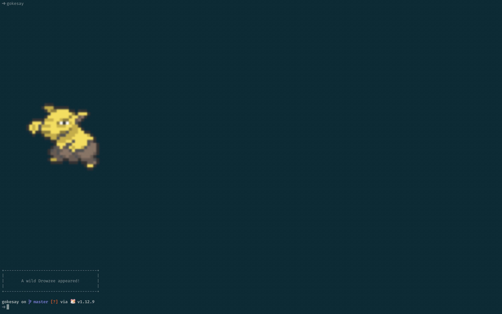

# Gokésay

Gokésay is a simple command-line tool that displays a random Pokémon in your terminal when invoked. It is heavily inspired by  [pokemonsay](https://github.com/dfrankland/pokemonsay).

### Usage 

After cloning/downloading this repo, run `go get` followed by  `go install` from within the project directory. 

Then you're all set! Just run `gokesay` at the command line to get your random Pokémon:

